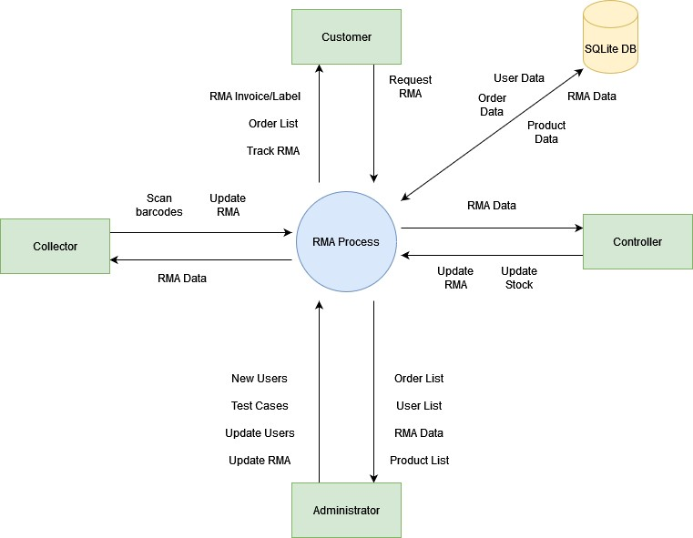
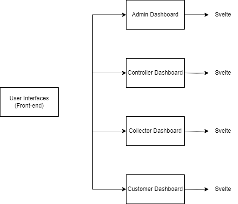
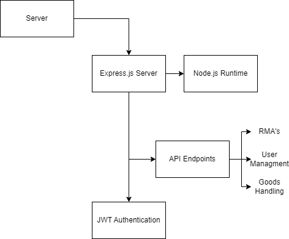
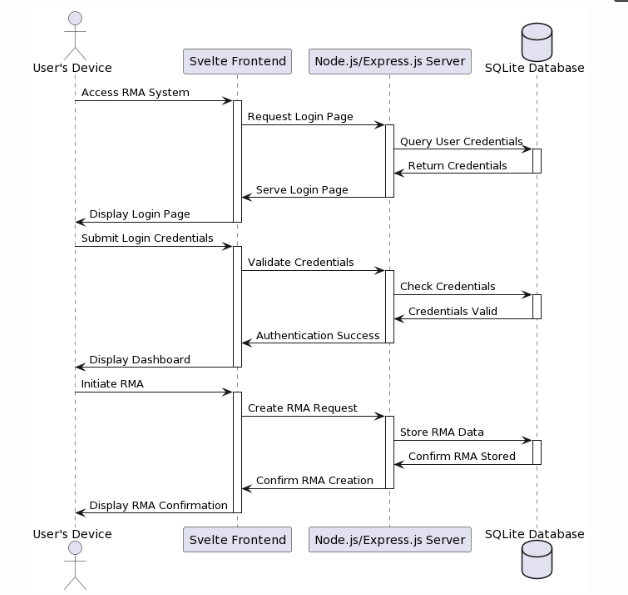
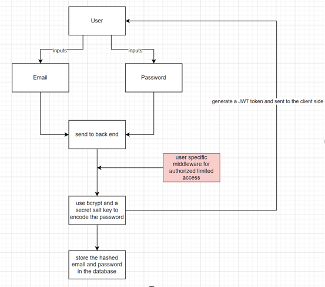
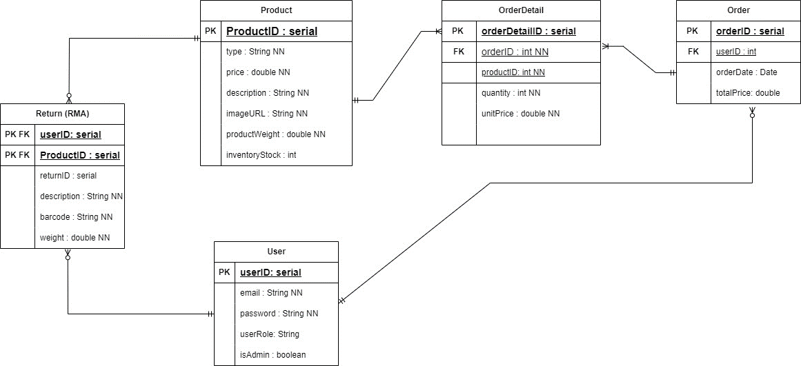
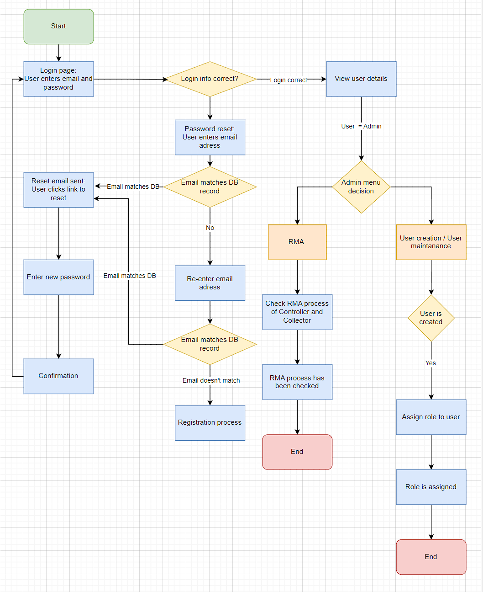
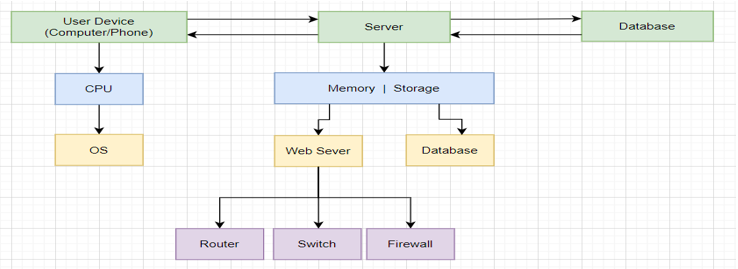
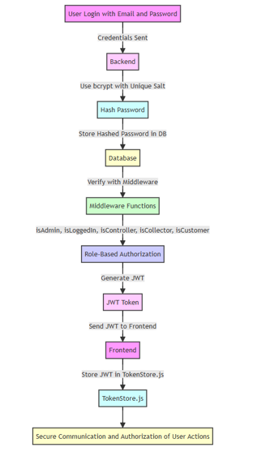

# System Design Documentation
## Client & Product Owner: John Zanoni, john.zanoni@myshop.com
## Group 2

### Contents

[Changelog](#_Toc153670417)

[Preface](#_Toc153670417)

[Summary](#_Toc153670417)

[1.0 Introduction](#introduction)

[1.1 Purpose of the SDD](#11-purpose-of-the-sdd)

[2.0 General Overview and Approach](#general-overview-and-approach)

[2.1 Approach](#21-approach)

[2.2 Methodology](#22-methodology)

[2.3 Collaboration](#23-collaboration)

[2.4 Constraints](#24-constraints)

[3.0 Design considerations](#design-considerations)

[3.1 System Architecture](#_Toc153670426)

[3.2 User Roles and Access Control](#_Toc153670427)

[3.3 Testing Environment](#_Toc153670428)

[3.4 Product Categorization and Constraints](#_Toc153670429)

[3.5 RMA Process Workflow](#_Toc153670430)

[3.6 Data Management and Security](#_Toc153670431)

[3.7 Refund and Stock Management](#_Toc153670432)

[3.8 Admin Supervision and Audits](#_Toc153670433)

[3.9 Mobile and Responsive Design](#_Toc153670434)

[3.10 Deployment Strategy](#_Toc153670435)

[3.11 Client Feedback and Iterations](#_Toc153670436)

[3.12 Constraints and Limitations](#_Toc153670437)

[4.0 System Architecture](#system-architecture-1)

[4.1 Logical view (functional components)](#_Toc153670439)

[4.1.1 Users](#users)

[4.1.2 Functionality:](#412-functionality)

[4.1.3 System Type](#413-system-type)

[4.1.4 Logical View Conclusion](#414-logical-view-conclusion)

[4.2 Hardware architecture (deploy)](#hardware-architecture-deploy)

[4.3 Software Architecture (overview, libs, protocols, frameworks, components, APIs, etc)](#_Toc153670445)

[4.3.1 Svelte](#431-svelte)

[4.3.2 Node.js with Express.js](#432-nodejs-with-expressjs)

[4.3.3 JSON Web Token (JWT)](#433-json-web-token-jwt)

[4.3.4 SQLite Database](#434-sqlite-database)

[4.4 Component Interactions - Sequence Diagram](#_Toc1536704510)

[4.5 Security architecture](#_Toc153670450)

[4.6 Performance](#performance)

[4.6.1 Performance Goals](#451-performance-goals)

[4.6.2 System Responsiveness](#452-system-responsiveness)

[4.6.3 Load Handling](#453-load-handling)

[4.6.4 Error Handling](#454-error-handling)

[5.0 System Design](#system-design)

[5.1 Database design](#_Toc153670457)

[5.2. User interface design](#_Toc153670458)

[5.2.1 Admin User Interface](#_Toc153670459)

[5.2.2 Customer User Interface](#_Toc153670460)

[5.2.3 Collector User Interface](#_Toc153670461)

[5.2.4 Controller User Interface](#_Toc153670462)

[5.4 Security Design](#54-security-design)

[Appendix A: Record of Changes](#appendix-a-record-of-changes)

# Changelog

| Version | Date       | Location            | Description                                                                | Author         |
|---------|------------|---------------------|----------------------------------------------------------------------------|----------------|
| 1.0     | 01-12-2023 | -                   | Initial Document Created – Pending Review                                  | Entire Group 2 |
| 1.1     | 04-12-2023 | 5.1 Database Design | Updated Database Technology to SQLite                                      | Georgi         |
| 2.0     | 16-12-2023 | Multiple locations  | Restructured Entire Document – Made changes (See Appendix A for full list) | Desmond        |
|         |            |                     |                                                                            |                |
|         |            |                     |                                                                            |                |

### Preface

Project Client on Board introduced myShop.com, an online SaaS software where a client can start an online store for B2B (Business to Business) and B2C (Business to Consumer) needs. A myShop.com client can design their online store using a range of templates, colors and layouts along with being able to easily implement a range of apps such as in-house developed systems, for example an Account Management system, or even Google apps such as Google Analytics.

As discussed in the Project Overview, the project entails building a system which can handle the Return Management Authorization (RMA) process.

**Please read the **SO2-MyShop-FunctionalDesign.md** before continuing with the System Design Document.

### Summary

The System Design Document (SDD) outlines the implementation of functional and non-functional requirements, system flow, and use cases recorded in the Functional Design Document (FDD). It provides a detailed breakdown of the system architecture, encompassing hardware, communication, software, and data design elements. The purpose is to guide the development of the RMA system at myShop.com while also serving as a framework for developers, ensuring a shared understanding of the project goals.

In terms of the general overview and approach, the myShop.com web system is tailored specifically for RMA processes within a web shop context. The 8-week development plan is structured into four 2-week sprints, prioritizing functionality, security, and user experience. This approach spans documentation, design implementation, UI refinement, and testing, allowing for flexibility based on ongoing client feedback.

Constraints are also acknowledged within the design considerations. Limitations in full system integration, the project's time frame, and the team's technical expertise, as students, pose challenges in terms of system access and technical capabilities. These constraints are vital considerations within the project's scope due to the limitations of prototyping.

The SDD encompasses a comprehensive breakdown of critical system elements, including system architecture, user roles, testing environment, product categorization, RMA workflow, data management, refund and stock management, admin supervision, mobile design, deployment strategy, client feedback iterations, and constraints.

It further elaborates on the system architecture, diving into detailed components covering logical, hardware, software, security, and performance aspects. This ensures platform independence, responsiveness, and adherence to security standards. Database design, hardware components, software frameworks, APIs, and robust security measures are highlighted within this section.

The user interface design is personalized for different roles, ensuring easy navigation, secure login processes, efficient RMA processing, and efficient system management for admins, customers, collectors, and controllers.

Lastly, the security design emphasizes procedures such as bcrypt hashing, unique salt keys, JWT tokens, and middleware functions to ensure user authentication, data confidentiality, and secure user interactions.

Overall the SDD serves as a proposal for the myShop.com RMA system, highlighting the required functionality, security, and user experience, striving to meet client expectations within the specified timeframe and constraints.

# 1.0 Introduction

The System Design Document (SDD) details how the functional and non-functional requirements, use cases, and system flow recorded in the Functional Design Document (FDD) should be implemented within the technical system when being built.

The SDD provides an overview of the system architecture broken into smaller sections focusing on hardware, communication within the system, software and external interfaces if required, and describes the data design within the system.

## 1.1 Purpose of the SDD

The SDD provides an outline to the client on how the RMA system at myShop.com will be developed, explaining how everything works such as what each user can do, how they interact with the system and what happens in the background to make it all function as it should. The SDD also explains how the components of the system are connected ensuring the system functions and meets the user’s needs. The SDD provides the framework for the team of developers (Group 2) ensuring a shared understanding of what to build.

# 2.0 General Overview and Approach

The myShop.com web system will be designed to address the distinct issues and requirements related to the RMA process for various purchases through a web shop. Focusing on the key aspects of functionality, security, and user experience over the course of 8 weeks, broken down into four 2-week sprints, our objective is to develop a working RMA system.

## 2.1 Approach

The approach taken to develop the system revolves around an 8-week timeline, strategically divided into four 2-week sprints. Each Sprint will focus on various aspects of Software Engineering involved with building a system.

Initial Sprint Focus\*:

1.  Sprint 1 – Documentation

    The initial sprint will involve creating documentation in the form of a Project Overview and a System Design. By developing the documentation beforehand we will have a clear structure to follow for the upcoming sprints where the design will be implemented.

2.  Sprint 2 & 3 – Implement the Design

    Focus on implementing the key requirements of each user and develop a working backend. The Sprint goals will be set out before each sprint and delivered to the client. (The requirements are stated in the Project Overview)

3.  Sprint 4 – User interface refinement and Testing

    The final sprint will address any concerns the client has about the system allowing time to make adjustments and create a variety of test cases to ensure the system functions as it should.

\*Subject to Change – Client shall be updated with each Sprint Goals at the start of the Sprint

## 2.2 Methodology

The scrum process will be implemented throughout the project. The scrum process is an Agile framework commonly used in software development. It involves dividing the work into time-bound iterations called sprints, where teams will collaborate daily to focus on delivering increments of a product. By implementing the scrum process, it aims to provide an increase in transparency and continuous improvement throughout the development process.

The product backlog will be implemented based on the requirements set out in the Project Overview. By having a product backlog, the team can easily assign tasks to specific sprints, while also providing an overview of who is assigned to each task. This allows the team to communicate effectively throughout the project ensuring there is no overlap of tasks.

## 2.3 Collaboration

During the project it is essential to ensure clear communication through the stand-up meetings and through our group chat, Discord for sharing documentation, WhatsApp for daily communication.

To ensure the project is following the requirements of the client, the client will be invited to join the end of Sprint reviews where feedback and discussion will be provided.

# 3.0 Design considerations

In the following chapter, the key design elements for the RMA system will be discussed to help provide an outline for the systems structure and functionality, and ensure that it caters to the user and business requirements effectively.

## 3.1 System Architecture

The myShop.com RMA system will be designed as a web-based solution to provide platform independence and ensure accessibility across various devices. Given the necessity for collectors to access the system on the go, special emphasis is placed on responsive design, ensuring functionality on both desktop and mobile platforms.

## 3.2 User Roles and Access Control

The system defines four primary user roles: Administrator, Collector, Controller, and Customer. Each role is associated with specific permissions to interact with the system, aligning with the principle of least privilege. For example, Collectors can update the status of RMAs but cannot initiate refunds, a task reserved for Controllers. A secure admin panel, intended to offer detailed control over user actions, is used to handle role assignments and permissions.

## 3.3 Testing Environment

To facilitate thorough testing, a mock-up environment mirroring the production system will be established. This environment will include a diverse set of test orders featuring various product types, prices, and special conditions such as excessively heavy products. Filters will be implemented to allow testers to simulate different scenarios, such as returns within the legal period or the handling of non-food items. This testing ground is crucial for uncovering any potential issues before deployment.

## 3.4 Product Categorization and Constraints

The system will incorporate logic to categorize products as either food or non-food and apply specific constraints for returns. Special conditions, such as the requirement for video games to be returned sealed, are also considered. This categorization plays a crucial role in the RMA process, ensuring that returns are processed in line with the company's policies.

## 3.5 RMA Process Workflow

The RMA creation workflow includes a customer-initiated process that allows for adding comments to the RMA and downloading a return label. The system supports tracking the RMA's status and enables cancellation under specific conditions, such as before the label is printed. The workflow is designed to be intuitive and user-friendly, guiding customers through each step to ensure clarity and efficiency.

## 3.6 Data Management and Security

Given the prototype nature of the project, customer data storage will be limited to essential information such as usernames and email addresses. The system's design will incorporate robust security measures, including data encryption, to ensure compliance with data protection standards, notably GDPR.

## 3.7 Refund and Stock Management

The system will manage refunds and stock adjustments following the return of products. The system will include an automated stock management feature that updates inventory levels in real-time as products are returned and processed by the controller. This feature is crucial for maintaining accurate stock records.

## 3.8 Admin Supervision and Audits

An admin dashboard will be implemented, providing administrators with a complete overview of all RMA activities. This feature allows admins to monitor the return process, view the involvement of specific staff members, and intervene in decisions when necessary. This functionality is essential for maintaining quality control and ensuring accountability within the RMA process.

## 3.9 Mobile and Responsive Design

Special attention is given to the mobile responsiveness of the system, ensuring that it functions seamlessly on mobile devices. This is particularly important for collectors who may access the system on the go. The design will be tested on various popular devices to guarantee optimal performance and usability.  
Devices to be tested for responsiveness: Apple iPhone, Samsung, Huawei (latest models 2019-2023).

## 3.10 Deployment Strategy

Initially, the system will be deployed on a local host for internal testing and refinement. Plans are in place for subsequent deployment on a virtual machine once we are provided with access to such an environment by our lecturers, allowing for broader accessibility and real-world testing.

## 3.11 Client Feedback and Iterations

The development process will incorporate regular feedback sessions with the client. These sessions are intended to review the system's progress, make necessary adjustments, and ensure that the final product aligns with the client's expectations and needs.

## 3.12 Constraints and Limitations

The design acknowledges certain constraints, such as the non-returnability of specific products and the limitation of prototype features like RMA cancellations once a label is printed. These constraints are factored into the system's functionality to ensure realistic and practical operation.

# 4.0 System Architecture

## 4.1 Logical view (functional components)

The logical view provides an overview of the interactions users will have with the RMA system. It allows the reader to gain an understanding on what the system should do and how it should react particularly when the reader's focus is on the system's functionalities rather than its technical intricacies.

### 4.1.1 Users

The key stakeholders with the system are the following:

**Administrator**: Responsible for managing user accounts, assigning roles, creating customers, and creating the test environment.

**Collector**: Responsible for managing the goods that have been returned to the company, they check the orders to make sure that all the goods are there and check their state to make sure they are as expected. They will document this with comments and images, they will then update the RMA status.

**Controller**: Responsible for deciding on the refund payments and notifying the customer on the finalization of the RMA. After finalizing, they will place the item back into the company stock.

**Customer:** Has placed orders, can create RMAs for non-food products, track RMA status, and cancel RMA requests within the legal return period.

### 4.1.2 Functionality:

#### 4.1.2.1 Administrator:

Administrator is responsible for managing user accounts, roles, and test environments, oversee RMA requests, and ensure efficient system functionality for collectors, controllers, and customers.

-   *User Management:*
    -   Create, update, and delete user accounts for collectors, controllers, and customers.
    -   Assign roles (Collector, Controller) to users.
    -   Ability to create test customer accounts for testing purposes.
-   *RMA Management:*
    -   View and manage RMA requests.
    -   See which controller and collector processed each RMA.
    -   Update the status of RMAs (e.g., processing, completed).
-   *Test Environment:*
    -   Ability to set up a test environment.
    -   Create paid orders in the test environment.
    -   Generate a mix of food and non-food products in the test environment.

#### 4.1.2.2 Customer:

The customer will be able to have an account oversight, including order tracking, RMA creation, status tracking, cancellation, and ensuring compliance with the defined return period and policy constraints.

-   *Account Management:*
    -   Login to access the system and the test environment.
    -   View a list of placed orders.
-   *RMA Creation:*
    -   Create an RMA for non-food goods within the 14-day return period.
    -   Add comments to the RMA.
    -   Download a return label for the goods.
-   *RMA Status and Cancellation:*
    -   Track the status of an RMA.
    -   Cancel an RMA request before the company receives the goods.
-   *Switching Products:*
    -   For product switches, initiate the return of the original product.
    -   Make a new order for the desired product.
    -   Ensure that stock and other checks are performed manually.
-   *Return Policy Validation:*
    -   Enforce the 14-day return period.
    -   Restrict RMA creation for goods outside the legal return period.
    -   Display clear information to customers about the return policy constraints.

#### 4.1.2.3 Collector:

They are responsible for processing returned merchandise authorisations (RMAs) and managing the physical return of products. Their main tasks include handling returned goods and updating the system accordingly.

-   *Process RMAs:*
    -   Scan package barcodes to identify expected goods.
    -   Mark RMAs as received.
    -   Unpack packages and inspect returned products for damage or issues.
    -   Update the status of RMAs to indicate processing.
    -   Document damaged goods with images and descriptions.
-   *Inventory Management:*
    -   Update inventory levels based on returned products.
    -   Mark returned products as damaged or available for resale.
-   *RMA Information:*
    -   View detailed information about RMAs they are processing.
    -   Dashboard accessible via a username/password.

#### 4.1.2.4 Controller:

They are responsible for overseeing the RMA process, ensuring compliance with company policies, and managing the overall flow of returned products.

-   *Manage RMAs:*
    -   Manage RMAs with the status "collected."
    -   Select RMAs for processing.
    -   Decide on refunding payments or notifying customers of damaged products.
    -   Update RMA status.
    -   Place undamaged products back in stock.
    -   View RMA history for customer validation.
    -   Dashboard accessible via a username/password.

### 4.1.3 System Type

The following section defines the type of system/application the project requires.

Based on the Project Overview the system must be a web-based application which has the functionality of being Mobile-friendly for collectors. By building a web-based application, the system should be able to be deployed on any device without configuration as it’ll be easily accessible through a web browser such as Chrome/Edge.

### 4.1.4 Logical View Conclusion

This logical view outlines the key users, their roles, and the core functionalities of the myShop.com RMA system. It provides an understanding of how the system is structured and how the different users interact with it.

## 4.2 Hardware architecture (deploy)

The server hosts the web system and manages the user’s requests. It will run the web system implementation, which will be written in JavaScript. The implementation will process the user’s data, perform different tasks such as login into their account, creating an RMA, managing the latter and etc. The database will store and manage the data. The database will receive queries from the server and return the results.

In our hardware architecture for the myShop.com RMA system, which is currently a test system, there are three primary components: the user's device, the web server, and the database server.

**User's Device**: This is the computer, smartphone, or tablet that you, the user, use to interact with the myShop.com RMA system. In the testing phase, you don't access the myShop.com website over the internet; instead, you use a web browser such as Google Chrome or Mozilla Firefox to connect to the system running on your own device or a local server- “localhost”. This allows us – the developers and testers to try out features such as logging in, reviewing order history, and initiating product returns, all within a controlled environment.

**Web Server**: During development and testing, this server is often a local server or a development server running on a virtual machine. It's the core of our online system while in the test phase. When you perform an action in the system, the web browser communicates with this web server over the local network. This server is where the myShop.com RMA system resides temporarily. It's responsible for handling your actions, like processing return requests (RMAs), by executing the system's code.

**Database Server**: During testing, our database is also located within the local environment or on a virtual machine. This server holds all the necessary data for the myShop.com RMA system, including user account details, RMA records, product information, and order history. When the web server needs to fetch or update data, it sends a query to the database server, which quickly processes it and returns the needed information.

As we move from testing to live deployment, these components will transition from the local testing environment to a hosted solution on a virtual machine, which allows the system to be accessed over the internet. But during the testing phase, everything is kept local to ensure security and ease of debugging. Once the system is fully tested and ready, it will be transferred to a virtual machine that mimics the live environment, ensuring a seamless transition for users from testing to actual use.

## 4.3 Software Architecture (overview, libs, protocols, frameworks, components, APIs, etc)

The following will be discussed further within the Software Architecture:

-   *Svelte*
-   *Node.js with Express.js*
-   *JSON Web Tokens (JWT)*
-   *SQLite for the Database*

### 4.3.1 Svelte

Svelte is a modern front-end, open-source JavaScript framework for making interactive web pages. It is like other existing frameworks, for example, Vue, but with other features which give us developers a better experience. One of the main plus features is the small number of lines needed to code, this can reduce room for error and improve the readability of our code.

Given its efficiency and ease of use, Svelte is well-suited for building responsive and interactive user interfaces for the Administrator, Customer, Collector, and Controller dashboards in our system. The Svelte component system also allows us to reuse code across our dashboards which keeps our code separated.

The components that we plan to use for our project to help keep our code separated will be the login/creation forms, the different dashboards for all the users, forms for creating RMAs, and the handling of the goods by the collectors and the status page for the tracking of the RMAs on the customer side.

### 4.3.2 Node.js with Express.js

Node.js is a powerful platform for building a variety of systems. It will allow us to easily add, delete and modify data in our database while also collecting data from our forms on the front end. It is known for its efficiency and scalability, making it a popular choice for modern web system development, especially for systems that require a persistent connection from the browser to the server as our one will have to, to stay working.

We plan to have different APIs and endpoints for keeping our code separated and so that no pages are too long, we will have an endpoint for user management including creating, managing, and assigning roles. An endpoint for RMA creation and tracking and an Endpoint for the handling of goods including the scanning, status updates and damage reporting.

### 

### 4.3.3 JSON Web Token (JWT)

JSON Web Tokens (JWT) will be used also in our backend to provide user authentication and authorisation to the system to make it secure and ensure that users are only ever supposed to do what the system allows them to do.

### 4.3.4 SQLite Database

Choosing SQLite as the database for your team's project can be attributed to several key advantages it offers, especially in terms of ease of use and compatibility in a team environment:

-   SQLite databases are portable across various operating systems and platforms, which is a crucial advantage for a diverse team using different development environments.
-   SQLite offers a high degree of reliability. It is well-tested and widely used in various systems, from small to large-scale.
-   For development and testing phases, SQLite is particularly useful. It allows each developer to have a local copy of the database.

## 4.4 Component Interactions - Sequence Diagram

The diagram illustrates the interaction flow between a user's device, a Svelte frontend, and a Node.js/Express.js server with an SQLite database for a Return Merchandise Authorization (RMA) system. It outlines the steps from accessing the system and logging in to initiating and confirming an RMA request. The process includes credential verification and data storage, showcasing the sequence of user and server actions required to complete the transaction.

## 4.5 Security architecture

The security architecture discusses how the system will allow users to access the correct part of the system by logging in with an email and password.

The user logs into the system with his email and password. The information of his inputs will then be sent to the backend and encrypted using bcrypt and salt key to encode the password. The bcrypt is a password hashing function to build cryptographic hash of the user inputs. It will be transformed into another string of characters, which is stored in the database. Hashed versions are difficult to reverse, which means if someone gains access to it, they cannot easily determine the original password. The secret salt key ensures that different users can have the same password because a random piece of data will be added to each password before it is hashed. The combination of bcrypt and a unique salt for each password provides a robust way to secure user passwords. On the server side there is user specific middleware (isAdmin, isLoggedIn, isController, isCollector, isCustomer) that validates that only the authorized users have permission to perform user specific actions. A JWT token is generated and sent to the front end to authorize the user. The jwt token in stored in a TokenStore.js on the client side of the system so it can be used to determine the role and permitted activities of a logged in user.

## 4.6 Performance

### 4.6.1 Performance Goals

Based on the requirements discussed in the Functional Design Documentation, the average response time of the system should be 1000ms (1 second) across core functions such as the user interface, database query to display data and authenticate users.

Secondly, the system should be capable of processing and handling 50 requests simultaneously while maintaining response times within specified thresholds.

### 4.6.2 System Responsiveness

**Core User Interactions**: The system should achieve an average response time of 1000ms for critical user interactions, measured and validated through user experience testing scenarios within the system.

**UI Responsiveness:** The user interface shall respond within 1000ms of user interaction with buttons, menus, or inputs, verified through UI performance tests within the system and user feedback.

**Database Queries:** Database queries should retrieve data within 1000ms, validated through database performance tests within the system.

**Authentication and Authorization:** Processes related to user authentication and authorization shall complete within specified timeframes to ensure access to secured areas without delays, verified through security and performance tests within the system.

### 4.6.3 Load Handling

The system shall sustain a throughput of approximately 50 requests simultaneously under peak load conditions, as verified by load testing tools and performance benchmarks.

### 4.6.4 Error Handling

In error conditions or exceptions, the system shall provide clear and understandable error messages within milliseconds, validated through error simulation tests and user validation within the system.

# 5.0 System Design

## 5.1 Database design

The database schema for the myShop.com RMA system outlines a comprehensive network of associations among users, products, orders, and return processes. The User table holds account details and roles, indicating if a user is an admin. Products are covered in the Product table with attributes such as price and stock levels. The Order table captures each order's overall information, while the many-to-many relationship between products and orders is managed through the Order Detail junction table, allowing for multiple products to be associated with a single order and vice versa. Returns are tracked in the Return (RMA) table, which maintains a one-to-many relationship with both User and Product, documenting each return instance with user and product IDs.

## 5.2. User interface design

### 5.2.1 Admin User Interface:
For the "Admin" role, the system's user interface (UI) starts with a standard login page, where administrators can enter their email and password. If login credentials are forgotten, the UI provides a password reset mechanism, where the admin must enter their email address to receive a password reset link, depending on the email matching the database (DB) records. After login, the admin views their user details and is presented with an admin menu for decision-making. From here, the admin can choose to go into user creation and maintenance or check the Return Merchandise Authorization (RMA) process for Controllers and Collectors. For user maintenance, the UI includes a workflow to create a new user and assign roles. This process involves input forms for user information and a selection mechanism for assigning roles, such as dropdowns or radio buttons. When checking the RMA process, the UI offers an interface that displays the RMA statuses managed by Controllers and Collectors. This functionality is a standalone function for the admin who is also acting as the supervisor, ensuring the integrity of the RMA process. At the end of either process — user maintenance or RMA checks — the UI confirms the completion of the task and provides a clear endpoint or logout option to securely exit the session. This admin-focused UI is designed to be user-friendly and secure, assuring effective management and oversight of the system's operations.

### 5.2.2 Customer User Interface:

The Customer's user interface (UI) is designed for clarity and ease of use, beginning with a simple login page that offers fields for email and password entry, along with a straightforward password reset link for those who have forgotten their login credentials.  
After the login is successful, the customer dashboard is shown that displays their details and provides a summary of placed orders. For any orders that need to be returned, the UI includes a function to create a Return Merchandise Authorization (RMA), which is conditional on the type and age of the order. This process has the option to add comments for context and the ability to download shipping labels for the returns.  
The UI also includes a tracking system for the RMA, allowing customers to stay updated on the status of their returns. In scenarios where an RMA needs to be cancelled, the UI presents a streamlined process to do so, provided the return has not been processed yet. If the return has already arrived at the company, the UI facilitates the cancellation and confirms the action with the customer via email.  
The session ends with a clear termination point, where the customer can log out, after the logout a confirmation message is displayed, ensuring the customer is aware that all processes have been completed and the session has been securely closed. The design of the UI considers the need for a user-friendly experience, where customers can easily manage their orders and returns with minimal effort.

### 5.2.3 Collector User Interface:

The user interface (UI) for the "Controller" role in the system starts with a login page where the Controller enters their email and password. if the Controller needs to reset his password, there is a workflow where he can enter their email address to receive a reset link, if the provided email matches the records in the database (DB).  
After successful login, the Controller is taken to a page where he can view his user details. They are presented with an interface that displays a list of Return Merchandise Authorizations (RMAs) with the status 'collected'. The Controller then picks an RMA to process.  
The UI for processing an RMA includes several functionalities:
- A functionality to notify customers about missing or damaged products, which could include an automated messaging system.
- A functionality to update the status of the RMA after review.
- A functionality to send an email to the customer if the refund is valid.
- A functionality to put products back in stock if they are not damaged.
- A functionality to show a customer's RMA history for validation processes. This could be a searchable database view or a customer-specific RMA history page.

The Controller's UI is designed to manage the RMA process effectively, with straightforward options for updating RMA statuses, handling refunds, and communicating with customers. It aims to ensure a smooth workflow from RMA review to the conclusion of the process, providing all necessary tools for the Controller to manage returns efficiently.

### 5.2.4 Controller User Interface
The user starts the system and enters his login credentials (email and password).  
The system checks if the entered data is matching the stored data inside the database. If the user forgot his password, he could reset his password by entering his email address and if the entered email is matching the database record an email is sent to the user for a password reset. The user clicks the link he receives from the email and enters his new password. A confirmation is shown to the user, and he can login with his email and new password. If the email is not matching the database record after two attempts the registration process will starts. Once the login info is correct the user can view his user details. In the example above the user logged in to the system is the controller. The controller can have a look at returned products and scans the label on the boxes which contain the products after the arrival of them. When the products are in good condition and are non-food or sealed videogames the controller confirms the refund, and the products are added back to the database. An email is sent to the customer with the confirmation of his refund and the process ends. On the other hand, if the products are not in good condition, food or open videogames the refund can’t be confirmed and an email is sent to the customer. After this the process ends.

### 5.3 Hardware design

## 5.4 Security Design

**User interface for Controller:**  
The user starts the application and enters his login credentials (email and password).  
The system checks if the entered data is matching the stored data inside the database. If the user forgot his password, he could reset his password by entering his email address and if the entered email is matching the database record an email is sent to the user for a password reset. The user clicks the link he receives from the email and enters his new password. A confirmation is shown to the user, and he can login with his email and new password. If the email is not matching the database record after two attempts the registration process will starts. Once the login info is correct the user can view his user details. In the example above the user logged in to the system is the controller. The controller can have a look at returned products and scans the label on the boxes which contain the products after the arrival of them. When the products are in good condition and are non-food or sealed videogames the controller confirms the refund, and the products are added back to the database. An email is sent to the customer with the confirmation of his refund and the process ends. On the other hand, if the products are not in good condition, food, or open videogames the refund can’t be confirmed and an email is sent to the customer. After this the process ends.

Our system implements a secure and efficient user authentication and authorization process. When a user attempts to log in with their email and password, these credentials are sent to the backend. Here, we employ bcrypt, a robust password hashing function, in conjunction with a unique salt key for each user. This approach ensures that even if two users have identical passwords, their hash values will be unique due to the addition of a random data place (salt) before hashing. Consequently, the hashed password, which is a transformed string of characters, is stored in our database. This method is highly secure as hashed versions are inherently difficult to reverse-engineer, ensuring that the original passwords remain confidential even if someone gains access to the database.  
Besides that, our server-side infrastructure includes specialized middleware functions such as ‘isAdmin’, ‘isLoggedIn’, ‘isController’, ‘isCollector’, and ‘isCustomer’. These play a crucial role in verifying that only authorized users can perform actions specific to their roles. Once a user is authenticated, our system generates a JWT (JSON Web Token), which is then sent to the frontend. This token is mandatory for maintaining secure communication and authorizing subsequent user actions.   
On the client side, this JWT token is stored in ‘TokenStore.js.’ enabling our system to consistently verify the user’s role and the activities they are permitted to engage in. This comprehensive system, combining bcrypt with a unique salt for each password and the use of JWT tokens, ensures a secure framework for user authentication and authorization within our system.

# Appendix A: Record of Changes

Version 1.1: 04-12-2023 – Georgi

-   Updated Database to SQLite
-   Updated System Architecture

Version 2.0 - 16-12-2023 – Desmond

-   Added Preface and Summary
-   Updated Introduction, General Overview, System Architecture
-   Added System Context Diagram to Logical View
